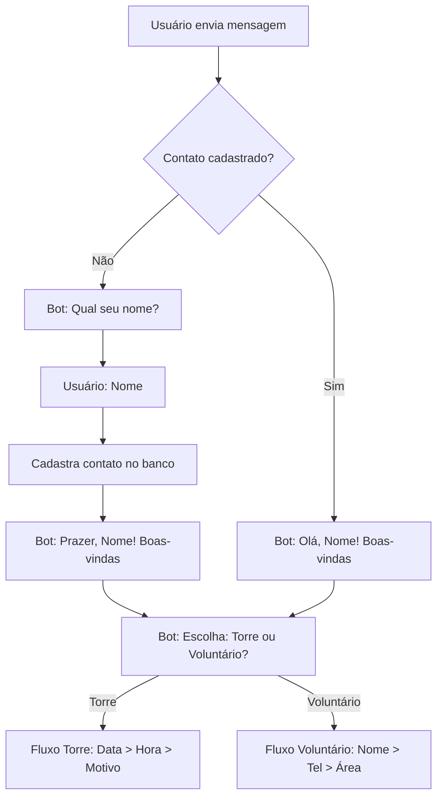

# 🤖 Melhorias Implementadas no Bot

## 📋 Resumo das Mudanças

Implementamos um fluxo completo de atendimento automático que:

1. ✅ **Verifica se o contato está cadastrado** antes de iniciar a conversa
2. ✅ **Solicita o nome** de contatos novos e os cadastra automaticamente
3. ✅ **Personaliza as boas-vindas** usando o nome do contato
4. ✅ **Oferece opções** de atendimento: Torre de Oração ou Voluntariado

---

## 🔧 Arquivos Modificados

### 1. [bot-agenda.service.js](src/services/bot-agenda.service.js)

**O que mudou:**
- Adicionado import do `contactRepository`
- Modificada função `processMessage()` para verificar se contato existe
- Implementado Step -1 para coleta de nome de novos contatos
- Cadastro automático de contatos após coleta de nome
- Mensagens de boas-vindas personalizadas com o nome

**Linhas modificadas:** 1-6, 65-139

---

## 📄 Novos Arquivos Criados

### 1. [BOT-FLOW-SETUP.md](BOT-FLOW-SETUP.md)

Documentação completa do fluxo do bot com:
- Estrutura das AutoResponses
- Exemplos de conversas
- Guia de configuração
- Explicação dos tipos de validação

### 2. [seed-bot-igreja.js](seed-bot-igreja.js)

Script Node.js para popular o banco de dados com as AutoResponses:
- Step 1: Escolha do serviço (Torre/Voluntário)
- Steps 2-4: Fluxo de agendamento na Torre de Oração
- Steps 5-7: Fluxo de cadastro de voluntários

**Como executar:**
```bash
node seed-bot-igreja.js
```

---

## 🎯 Fluxo Completo

### Para Novo Contato



### Exemplo de Código Alterado

**Antes:**
```javascript
// Sempre enviava boas-vindas direto
if (session.step === 0) {
  session.step = 1;
  return {
    message: botConfig.welcomeMessage,
    shouldContinue: true
  };
}
```

**Depois:**
```javascript
// Verifica se contato existe
if (session.step === 0) {
  const contact = await contactRepository.findByNumber(phone.replace(/\D/g, ''));

  if (!contact) {
    // Pergunta nome
    session.step = -1;
    return {
      message: '👋 Olá! Bem-vindo(a)!\n\n📝 Para começarmos, por favor, me informe seu nome:',
      shouldContinue: true
    };
  } else {
    // Boas-vindas personalizadas
    session.step = 1;
    return {
      message: `👋 Olá, *${contact.name}*! ${botConfig.welcomeMessage}`,
      shouldContinue: true,
      nextStep: await this.getNextQuestion(botConfig, 1)
    };
  }
}

// Processa nome quando step = -1
if (session.step === -1) {
  const name = message.trim();

  const newContact = await contactRepository.updateOrCreate(phone.replace(/\D/g, ''), {
    name,
    phone: phone.replace(/\D/g, ''),
    sessionName
  });

  session.step = 1;
  return {
    message: `👋 Prazer em conhecê-lo(a), *${newContact.name}*!\n\n${botConfig.welcomeMessage}`,
    shouldContinue: true,
    nextStep: await this.getNextQuestion(botConfig, 1)
  };
}
```

---

## 🚀 Como Testar

### 1. Popular o Banco de Dados

Execute o script de seed para criar as AutoResponses:

```bash
node seed-bot-igreja.js
```

**Saída esperada:**
```
🔌 Conectando ao MongoDB...
✅ Conectado ao MongoDB
✅ Bot encontrado: Bot Igreja Principal (676...abc)
🗑️  0 AutoResponses antigas removidas
📝 Inserindo 7 AutoResponses...
✅ 7 AutoResponses inseridas com sucesso!

📋 Resumo:
   Bot: Bot Igreja Principal
   Responses: 7
   Steps configurados:
     - Step 1: Escolher serviço (Torre de Oração ou Voluntário)
     - Steps 2-4: Fluxo Torre de Oração
     - Steps 5-7: Fluxo Voluntário

🎉 Seed concluído com sucesso!
🔌 Desconectado do MongoDB
```

### 2. Reiniciar o Servidor

```bash
npm start
```

### 3. Testar no WhatsApp

**Cenário 1: Novo Contato**

```
Você (número novo): Oi

Bot: 👋 Olá! Bem-vindo(a)!
     📝 Para começarmos, por favor, me informe seu nome:

Você: João Silva

Bot: 👋 Prazer em conhecê-lo(a), João Silva!
     Como posso ajudá-lo(a) hoje?

     Escolha uma das opções abaixo:
     1️⃣ Marcar horário na Torre de Oração
     2️⃣ Quero ser um voluntário

Você: 1

Bot: Ótimo! Vamos prosseguir com sua solicitação.
     📅 Por favor, informe a data desejada...
```

**Cenário 2: Contato Existente**

```
Você (número cadastrado): Olá

Bot: 👋 Olá, João Silva! Como posso ajudá-lo(a) hoje?

     Escolha uma das opções abaixo:
     1️⃣ Marcar horário na Torre de Oração
     2️⃣ Quero ser um voluntário
```

---

## 📊 Logs Esperados

Com `LOG_LEVEL=debug`, você verá:

```
[INFO]: [local] 📩 Nova mensagem recebida de: 556294421733@c.us
[INFO]: 🤖 Bot "Bot Igreja Principal" vinculado à sessão local - processando automaticamente
[INFO]: 👤 Novo contato 556294421733 - solicitando nome
```

Após receber o nome:

```
[INFO]: ✅ Contato criado: João Silva (556294421733)
```

Para contatos existentes:

```
[INFO]: 👤 Contato encontrado: João Silva (556294421733)
```

---

## 🔍 Troubleshooting

### Problema: Bot não pergunta o nome

**Verificar:**
1. Se o contato já existe no banco:
   ```javascript
   db.contacts.findOne({ phone: "556294421733" })
   ```
2. Se o bot está vinculado à sessão correta
3. Logs do servidor para ver se está executando o código novo

### Problema: Nome não está sendo salvo

**Verificar:**
1. Conexão com MongoDB
2. Logs de erro do `contactRepository.updateOrCreate()`
3. Permissões de escrita no banco

### Problema: Mensagem de boas-vindas não personaliza

**Verificar:**
1. Se o `botConfig.welcomeMessage` está configurado
2. Se o contato foi encontrado (`session.contactName` existe)
3. Logs do step de boas-vindas

---

## 📝 Notas Importantes

1. **Step -1** é especial e usado apenas para coleta de nome
2. **Step 0** é o estado inicial da sessão
3. **Step 1+** são as perguntas configuradas nas AutoResponses
4. O nome do contato é salvo automaticamente e pode ser usado em mensagens futuras
5. Contatos duplicados são evitados pela função `updateOrCreate()`

---

## 🎨 Personalizações Futuras

### Adicionar mais campos ao contato:

```javascript
const newContact = await contactRepository.updateOrCreate(phone, {
  name,
  phone,
  sessionName,
  email: session.data.email,  // Se coletar email
  city: session.data.city,    // Se coletar cidade
});
```

### Mensagens personalizadas por horário:

```javascript
const hour = new Date().getHours();
let greeting = hour < 12 ? 'Bom dia' : hour < 18 ? 'Boa tarde' : 'Boa noite';
const message = `👋 ${greeting}, *${contact.name}*! ${botConfig.welcomeMessage}`;
```

### Guardar histórico de interações:

```javascript
session.history = session.history || [];
session.history.push({
  timestamp: new Date(),
  message: message,
  step: session.step
});
```

---

**Data de implementação:** 2025-12-19
**Desenvolvido por:** Claude Code
**Versão:** 1.0
